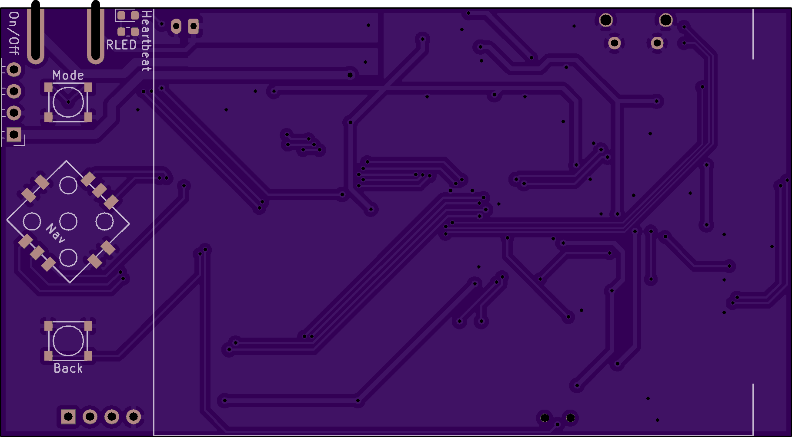

# "MotoMate" Handheld GPS Receiver

This is a small board designed to act as a handheld GPS receiver, and eventually (I hope) a handlebar-mounted GPS mapper / tracker for offroad motorcycling.

# Details

The microcontroller core is an STM32L496Rx chip - I recommend the STM32L496RGT3, because it costs less than $1 to get an extra 512KB of Flash. The 320KB of built-in RAM is enough to store a 150KB framebuffer for the 320x240 16bpp ILI9341 display, but it doesn't leave much room for storage-intensive algorithms such as image processing. Still, there's no external storage to worry about besides the microSD card.

The board is wired to use hardware periphererals for driving the SD/MMC interface, USB OTG, SPI for the display, and UART for talking to a "GY-NEO6MV2" GPS module. I've noticed that some listings for these u-blox Neo-6M-based GPS modules have red-colored boards with pinouts that won't work with this design; look for blue-colored ones and double-check the pinouts against the schematic. I might update the design to use the module itself instead of a cheap breakout board in the future, but for now, sorry for the inconvenience.

There's also a single-channel audio amplifier connected to one of the chip's DACs with a mute switch, and some ADCs are used to monitor a photodiode and the board's battery voltage. And there are pads exposed for an extra UART and I2C connection, and seven button inputs split across two tactile buttons and a 'navigation switch'. The buttons are assigned to pins so that there shouldn't be any conflicts with EXTI lines when setting up interrupts to listen for presses.

I'll write up more comprehensive information (and upload some proper gerber files) once I've had a chance to test this revision and upload some basic test firmwares to confirm the board's various functions.

# Schematic and Board Renders

# Previous Revision

I've assembled an earlier version of this design and confirmed that most parts of the design work, but I haven't written a comprehensive "GPS mapper" firmware yet. The first version has too much space between the TFT ribbon connector and the edge of the board to fold the display over the USB connector and mute switch, so it was awkward to handle. I hope that this version will fit together better, but I haven't received it yet for testing.

Sorry that I didn't get a better picture of the lit-up TFT; it's hard to take pictures of backlit displays, and it's not that important anyways. I also edited one of the images to remove the actual GPS coordinates, because I didn't feel like driving out to the middle of the woods to take a picture.

Anyways, so far I've tested (or not) the following parts:

* Battery monitoring: the 'charging' and 'done' LEDs seem to reflect the charge status, and the 12-bit ADC reads close to 4.2V on a full charge using the formula: `VBatt = ( ADC * 2 / 4095 ) * 3.3`. Note that for an accurate reading, you need to set one of the highest sampling times (250-650 cycles) due to the low amount of current flowing through the voltage divider.

* TFT display: The backlight can be adjusted with a PWM signal, and the SPI peripheral can be used with DMA to draw a framebuffer to the display. This makes it much easier to test other parts of the board :)

* GPS module: Appears to work, although I haven't tried configuring it with anything other than the default settings. After placing the antenna with a clear view of the sky and letting it acquire a few satellites, it reports latitude and longitude readings that appear to be accurate to within maybe 5 meters or so.

* microSD card: Not tested.

* Buttons: Tested using falling-edge interrupts with the pins configured as inputs with pull-up resistors enabled. These low-profile buttons are really designed to be used with a case that has plastic or rubber 'pegs' connected to larger buttons, though.

* Auxiliary UARTs and I2C: Not tested.

* 'Heartbeat' LED: Works.

* Photodiode: Not tested; in the first revision of the board, I put the photodiode underneath where the display's ribbon connector folded over, so it was always in darkness. D'oh!

* Speaker: Works well enough to play a sine wave accurately enough for a tuner to read the desired note. I haven't tried playing music or speech though, and it probably wouldn't do that very well. This is only a 12-bit DAC with poor filtering, after all. The speaker is mostly intended for beeps, buzzes, and chirps.

See `firmware/` for the source code used to run those tests, and `fw_lib/` for some shared helper functions.
